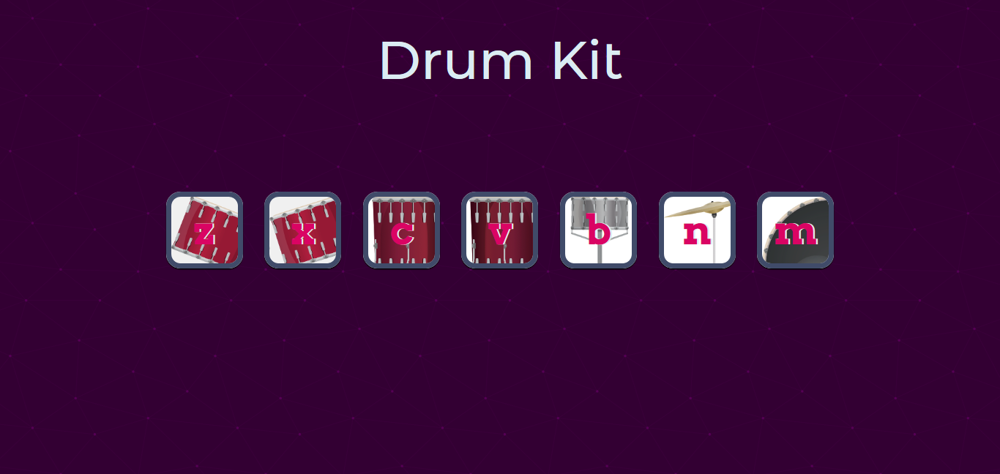

# Simple Drum Kit - Javascript

In this drum kit project I have used  some of the more intermediate advanced parts of the document object model or the javascript dom to show  how to build this drumkit Web site. In this project we would have not only understood how to add event listeners to buttons and keystrokes so that we will  know when the user is tapping on the keyboard or clicking on a particular button on your Web site and we can respond to it. 

You can impress all of your friends with this awesome Web site. So the way that this works is that we've got a number of keys here that represent different drums in a typical drum set. And when you click on any of these buttons then you'll get the corresponding sound of the drum. And in addition you can also use the keys on the keyboard (z,x,c,v,b,n,m).

## Screenshots

